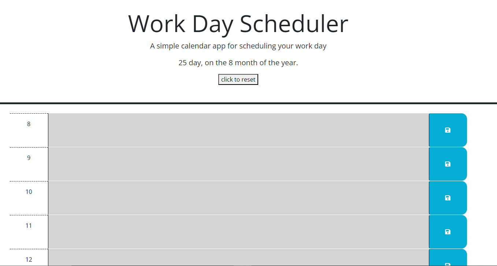

# my-day-planner-JH
a day planner that edits your schedule as time passes
no help from outside sources on this one other than w3 schools.

ADVISORY I was on vacation in Europe during this assignment and had to make due with what I had. I would like to learn more about functions and loops/ conditionals to condense this code... heavily.

This program is an event planner that displays the day of the month with boxes representing a schedule. The schedule can be loaded with events that persist on page refresh and can only be removed by pressing the reset button or the day changes.
A user can input their schedule and as their day moves forward, the boxes will notify, via color change, a past present or future status. 

links and photo below.
https://github.com/lilcobby/my-day-planner-JH
https://lilcobby.github.io/my-day-planner-JH/

